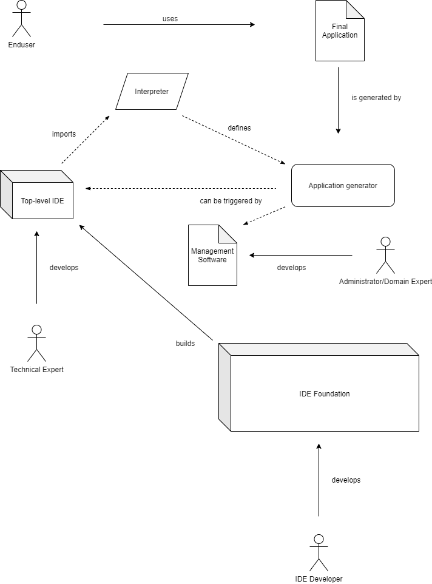
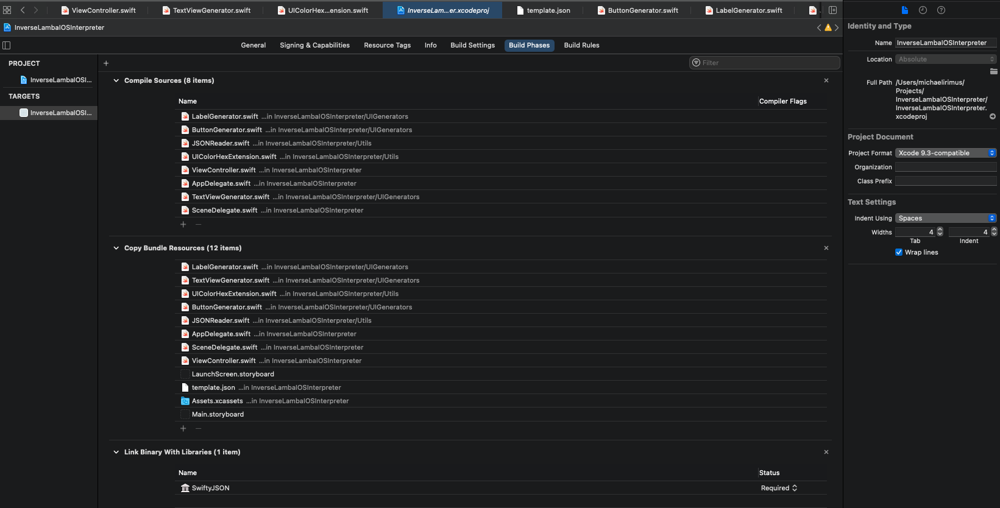

# Inverse Lambda IOS Interpreter

This applicaton serves as one of many possible **interpreters** and **application generators** of the Inverse Lambda ***y?*** project. The diagramm below visualizes the planned scope. As of now, the interpreter is defined by the Swift Code in this repository which enables a manual generation of an iOS application.

## How-To

### Requirements for building the application
* macOS as the running operating system
* [Xcode](https://developer.apple.com/xcode/)
* [Xcode Command Line Tools](https://stackoverflow.com/questions/9329243/how-to-install-xcode-command-line-tools)
* [iOS Simulator](https://developer.apple.com/library/archive/documentation/IDEs/Conceptual/iOS_Simulator_Guide/GettingStartedwithiOSSimulator/GettingStartedwithiOSSimulator.html) or an iPhone

#### Requirements for just running the application

* any current model of iPhone

### Building the application

1. Retrieve `.json`-File from Inverse Lambda's [Top-Level IDE](https://gitlab.com/fh-campus/software-engineering/inverse-lambda/basic-y). Alternatively, manually create a `.json`-File which matches the **file format criteria** (see [Top-Level IDE](https://gitlab.com/fh-campus/software-engineering/inverse-lambda/basic-y) or in the example template under `/InverseLambaIOSInterpreter/template.json`).
2. Either deploy it automatically or manually into the root folder of this project (`/InverseLambaIOSInterpreter/`).
3. Open the Project in Xcode.
4. Make sure you have selected the correct setting for the Build Phases of the project (see image below).

5. Select a previously installed iOS Simulator Device or a plugged in and permitted iPhone as the build destination.
6. Build the Product.

## FAQ

If problems occur, please see the [iOS Programming FAQ's](https://github.com/riOSProgramming/FAQ) first.